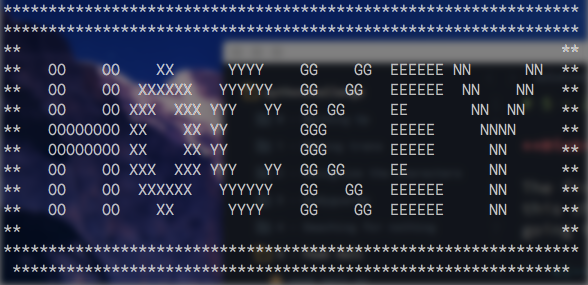

# 6 - Zip files

**Hint**:

The first hint is kind of obvious, it is showing us a zipper so we can assume
this challenge is about Zip files. When inspecting the source code we are also
going to see a comment like this.

```<!-- <-- zip -->```

**Solution**:

The first obvious thing we can try is to change the `.html` extension from the URL
and write `.zip` instead. When we do so, a `.zip` file is going to be download, after
decompressing the file a lot of `.txt` files are going to come up. There is going to
be a lot of files named with a number and similar content of _the game of nothings_, but 
the only file that can really help us is one called `readme.txt`. The content is the following:

```
welcome to my zipped list.

hint1: start from 90052
hint2: answer is inside the zip
```

Now we know this is similar to the _game of nothings_ we can write a simple program to
read the files in the correct order. When we finish, we will end up with one file with the content
telling us to look at the comments, in Zip files we're allowed to write some extra content
on all files, and comments are one of those extra content. If we concatenate all those comments
in the correct order and print it, we are going to see a word drawn with ASCII art: 



The naive approach will be to immediately go to **/hockey.html** but we are supposed to go
to **/oxygen.html** instead. The word **OXYGEN** can be obtained by looking at the specific
letters that conform the word **HOCKEY**.

We can go:

**From**: [http://www.pythonchallenge.com/pc/def/**peak**.html](http://www.pythonchallenge.com/pc/def/channel.html)

**To**: [http://www.pythonchallenge.com/pc/def/**channel**.html](http://www.pythonchallenge.com/pc/def/oxygen.html)

